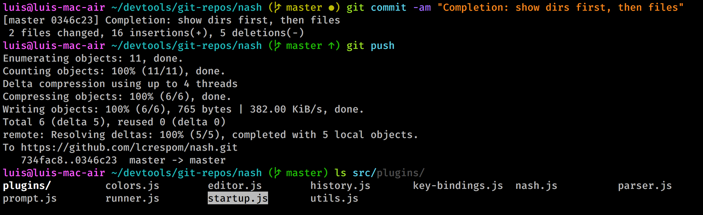

# Nash
Nash is a command-line editor for `bash` or compatible shells. It handles user input to provide a better user experience, but when the user hits the `Enter` key, it simply passes the command to `bash` for processing.

Nash is implemented in JavaScript and focuses on:
- Providing great UX and productivity to the command-line.
- Being highly extensible and customizable.
- Bringing shell power to JavaScript developers. Shells such as `zsh` or `fish` are greatly configurable,
	but customizing them requires writing shell script code, which (for JS developers) is not as user
	friendly as JavaScript.



Pressing F1 at any time displays a list of all keyboard shoutcuts and their corresponding actions.

## Main features
- Totally configurable prompt.
- Powerful history navigation: the `up` and `down` keys navigate the history, showing only the entries
	that start with the current line.
- Interactive tab-completion: pressing tab completes a file name, but if multiple matching files are
	available, an interactive menu is displayed, letting the user navigate and select the file name.
- Syntax highlight, clearly coloring the different parts of a command, and warning of potential errors.
- History suggestions: when typing a command, if the text matches a previous command, the remaining text
	is displayed in grey, letting the user immediately complete the command.
- Configurable color palette. Colors can be configured by name (e.g. red, gren, etc.) or by RGB hex as
	in CSS (e.g. #a6e22e).
- Configuration and extensions are implemented as plain JavaScript code, centered around the
	`~/.nash/nashrc.js` file, which is loaded during startup. For instance, color settings can be
	configured via JSON. Example configuration and extensions are provided in the `~/.nash` directory.
- Extensible plugin system with powerful default implementations.


## Installation
Being still under development, the way to install `nash` is to just clone the repo, then type `npm install`. To open a shell, type `npm start`.
```
git clone https://github.com/lcrespom/nash.git
npm install
npm start
```

### Windows
There is no direct Windows support, but an Ubuntu terminal can be installed in windows very easily through the Microsoft Store. See instructions [here](https://tutorials.ubuntu.com/tutorial/tutorial-ubuntu-on-windows). You will need to install the Ubuntu version of `node` and `npm` through the debian package manager, i.e. `sudo apt install node` and `sudo apt install npm`, respectively.


## ToDo
- [ ] Documentation
	- [x] Screenshots
	- [x] Features
	- [x] Examples directory with documented customizations
	- [x] Copy examples to `~/.nash` upon first startup
	- [ ] Usage
	- [ ] Customization / Extension API
- [ ] Line editing
	- [x] Handle multiple independent bindings for the same key combination
	- [ ] Add more bash shortcuts in default-bindings
		(see https://ss64.com/bash/syntax-keyboard.html)
		- [ ] Ctrl-y recovers deleted line (**next**)
	- [ ] Catch exceptions in bindings to avoid breaking the shell
	- [ ] Refactor prompt.js and editor.js async handling code => use more promises
- [x] History navigation
	- [x] Basic
	- [x] Context sensitive
	- [ ] Cool popup
- [x] Prompt plugin
	- [x] Optional agnoster-style prompt
	- [x] Document agnoster prompt & place in examples dir
- [x] Completion
	- [x] Basic (tab)
	- [x] Replace ~ with home when globbing
	- [x] Advanced (navigate over list)
		- [x] Handle lists too long to display in menu
		- [x] Highlight menu content: (dirs in white, consider other cases)
		- [x] Properly format and handle paths with blanks
		- [ ] Contemplate rest of word at right of the cursor
		- [ ] Let the user type and update menu accordingly (implement inside widget)
		- [ ] Selecting a directory (using space) opens menu with directory contents
	- [x] Customizable (e.g. git command list, etc.)
		- [ ] Optional subcommand description - if available, show under menu
		- [ ] Other programs?
- [x] Syntax highlight
- [x] History suggestions
	- [x] Remove suggestion decoration when the user presses enter
	- [ ] Ctrl-space accepts suggestion anywhere in the line (**next**)
	- [ ] Fix bug: if suggestion text overflows to next line, it is not cleared
- [x] Configuration (~/.nash/nashrc and ~/.nash/nashrc.js)
	- [x] Load all plugins from nashrc.js
- [x] JavaScript
	- [ ] Highlight JavaScript (and avoid bash parser error)
	- [ ] Get shell environment variables before executing JS
	- [ ] Embedded JS code context using 'with'
- [ ] Cool extensions
	- [x] Cool git prompt
		- [x] Fancy git status stripe in agnoster-prompt.js
		- [x] Git status stripe in default prompt
	- [ ] History popup
	- [ ] Directory navigation popup (history / tree)
	- [ ] Mouse support for all menus (keypress module supports it)
- [ ] Maximize customization
	- [x] Global settings object / API
	- [x] Color palette
	- [x] Rebind/unbind keys
- [ ] Compatibility / Portability
	- [ ] GitBash support
	- [x] More linux testing
	- [x] Slow/remote terminal
- [ ] Performance
	- [ ] Benchmark together: parsing + syntax highlight - find bottlenecks, memoize if required
