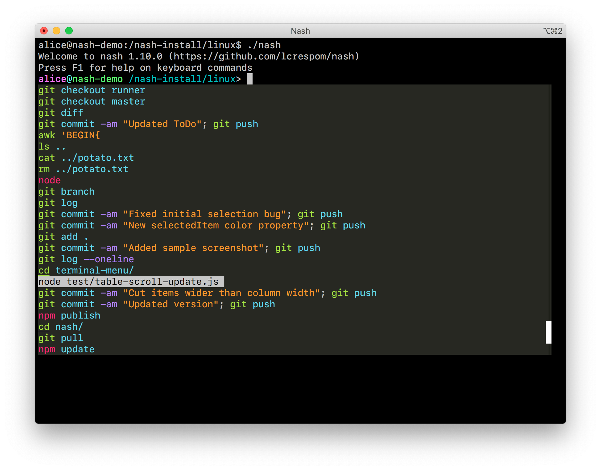

# Screenshots

### The default command prompt on a directory with a Git repository:

### File completion, with scrollbar and file description:

### Option completion, with a description for each option extracted from man pages:

### Interactive command history, each line with syntax highlight:
